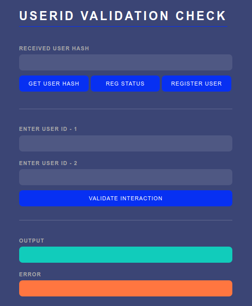
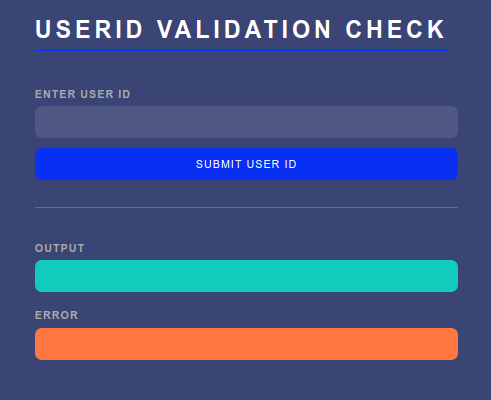

# Dapp Development
Here, I have documented how I developed a decentralized application on top of a private Ethereum network on Ubuntu 16.04. In this particular example I have considered an Identity Management system for authorization security. It is capable of performing the following operations :

#### 1. User Registration
* For registering new users by splitting the hash into 2 parts - key and subHash (termed so since it is a substring of the hash). The subHash is used for unique identification of network participants and users.
* In case of key collision, the user needs to provide additional information which is combined with available data so that the registration system arrives at a unique key-subHash pair.
  * For example, a vehicle registry system can make use of vehicle company, model, date of purchase, etc

#### 2. User Validation
* Once a user has registered onto the permissioned network, it can begin performing various operations.
* This function verifies the user’s credentials and only after validation, allows them to use the application.
* This also checks for collision, i.e. when 2/more users exist whose hash has the same key. In this case, the client is alerted and suggested to use additional parameter for user registration and to calculate hash.

#### 3. Interaction Eligibility (or Validation)
* For a interaction to be successful, both the users - receiver and sender - need to be a part of our permissioned network.
* The interaction is submitted onto the network only after both users have been authenticated.

<br>

************************************************************************************************************

<br>

## Table of Contents

### [I. Creating the project](https://github.com/amey-github/ceeri/tree/master/IDMTruffle#i-creating-the-project-1)

### [II. Installing prerequisites](https://github.com/amey-github/ceeri/tree/master/IDMTruffle#ii-installing-prerequisites-1)

* [Installing Golang](https://github.com/amey-github/ceeri/tree/master/IDMTruffle#a-installing-golang)
* [Installing geth](https://github.com/amey-github/ceeri/tree/master/IDMTruffle#b-installing-geth)
* [Installing NodeJS](https://github.com/amey-github/ceeri/tree/master/IDMTruffle#c-installing-nodejs)
* [Installing Truffle](https://github.com/amey-github/ceeri/tree/master/IDMTruffle#d-installing-truffle)

### [III. Configuring the network](https://github.com/amey-github/ceeri/tree/master/IDMTruffle#iii-configuring-the-network-1)

### [IV. Designing the smart contract](https://github.com/amey-github/ceeri/tree/master/IDMTruffle#iv-designing-the-smart-contract-1)

* [Contract code](https://github.com/amey-github/ceeri/tree/master/IDMTruffle#a-contract-code)
* [Testing the contract](https://github.com/amey-github/ceeri/tree/master/IDMTruffle#b-testing-the-contract)

### [V. Setting-up the Truffle project](https://github.com/amey-github/ceeri/tree/master/IDMTruffle#v-setting-up-the-truffle-project-1)

### [VI. Launching the network](https://github.com/amey-github/ceeri/tree/master/IDMTruffle#vi-launching-the-network-1)

- **[Default Truffle construct](https://github.com/amey-github/ceeri/tree/master/IDMTruffle#1-default-truffle-construct)**
- **[Modified Truffle set-up](https://github.com/amey-github/ceeri/tree/master/IDMTruffle#2-modified-truffle-set-up)**
- **[Manually configured private network *(used here)*](https://github.com/amey-github/ceeri/tree/master/IDMTruffle#3-manually-configured-private-network-used-here)**

  * [Creating Node-1](https://github.com/amey-github/ceeri/tree/master/IDMTruffle#1a-creating-node-1)
  * [Restarting Node-1](https://github.com/amey-github/ceeri/tree/master/IDMTruffle#1b-restarting-node-1)
  * [Creating Node-2](https://github.com/amey-github/ceeri/tree/master/IDMTruffle#2a-creating-node-2)
  * [Restarting Node-2](https://github.com/amey-github/ceeri/tree/master/IDMTruffle#2b-restarting-node-2)
  * [Linking with the network](https://github.com/amey-github/ceeri/tree/master/IDMTruffle#3-linking-with-the-network)
  * [Deploying the smart contract](https://github.com/amey-github/ceeri/tree/master/IDMTruffle#4-deploying-the-smart-contract)

### [VII. Building the web app](https://github.com/amey-github/ceeri/blob/master/IDMTruffle/README.md#vii-building-the-web-app-1)

- **[Front-end : Client interface](https://github.com/amey-github/ceeri/blob/master/IDMTruffle/README.md#a-front-end--client-interface)**
  * [Creating index page](https://github.com/amey-github/ceeri/blob/master/IDMTruffle/README.md#1-creating-index-page)
  * [Creating admin page](https://github.com/amey-github/ceeri/blob/master/IDMTruffle/README.md#2-creating-admin-page)
  * [Adding CSS](https://github.com/amey-github/ceeri/blob/master/IDMTruffle/README.md#3-adding-css)
  * [Adding JS functionality](https://github.com/amey-github/ceeri/blob/master/IDMTruffle/README.md#4-adding-js-functionality)

- **[Constructing UID-Hash file](https://github.com/amey-github/ceeri/blob/master/IDMTruffle/README.md#b-constructing-uid-hash-file)**

- **[Setting up middleware : Express.js](https://github.com/amey-github/ceeri/blob/master/IDMTruffle/README.md#c-setting-up-middleware--expressjs)**

### [VIII. Testing the dapp](https://github.com/amey-github/ceeri/blob/master/IDMTruffle/README.md#viii-testing-the-dapp-1)

* [User Registration](https://github.com/amey-github/ceeri/blob/master/IDMTruffle/README.md#1a-user-registration)
  * [Adversial Scenarios](https://github.com/amey-github/ceeri/blob/master/IDMTruffle/README.md#1b-adversial-scenarios)

* [Interaction Eligibility](https://github.com/amey-github/ceeri/blob/master/IDMTruffle/README.md#2a-interaction-eligibility)
  * [Adversial Scenarios](https://github.com/amey-github/ceeri/blob/master/IDMTruffle/README.md#2b-adversial-scenarios)

### [IX. Modifying the dapp](https://github.com/amey-github/ceeri/blob/master/IDMTruffle/README.md#ix-modifying-the-dapp-1)

* [Binding a system IP](https://github.com/amey-github/ceeri/blob/master/IDMTruffle/README.md#a-binding-a-system-ip)
* [Altering the HTML, CSS](https://github.com/amey-github/ceeri/blob/master/IDMTruffle/README.md#b-altering-the-html-css)
* [Add new JS functions](https://github.com/amey-github/ceeri/blob/master/IDMTruffle/README.md#c-add-new-js-functions)
* [Modifying the smart contract](https://github.com/amey-github/ceeri/blob/master/IDMTruffle/README.md#d-modifying-the-smart-contract)

### [X. References](https://github.com/amey-github/ceeri/blob/master/IDMTruffle/README.md#x-references-1)

<br>

************************************************************************************************************

<br>

## I. Creating the project
To create and move into a dedicated repository for the dapp, run in a new terminal window :
```
$ mkdir TruffleDapp
$ cd ./TruffleDapp
```

<br>

************************************************************************************************************

### IMPORTANT

**1. All commands and steps mentioned henceforth should be executed within the `TruffleDapp` repository, unless mentioned otherwise**

**2. The web browser used here is Chromium**

************************************************************************************************************

<br>

## II. Installing prerequisites

This section details the steps to set up the prerequisites for developing the dapp. The versions required are listed below:
* NVM v8.11.3
* NPM v5.6.0
* Golang (aka go) v1.10.3
* Geth v1.8.27-stable

### (a) Installing Golang

1. Download `go1.10.3.linux-amd64.tar.gz` package into `~/Downloads` from [here](https://golang.org/doc/install?download=go1.10.3.linux-amd64.tar.gz).

2. Extract the downloaded package with :
   ```
   $ tar xzvf ~/Downloads/go1.10.3.linux-amd64.tar.gz
   ```

3. Add to `~/.profile` and `~/.bashrc` file :
   ```
   # set GO variables to config go env
   export GOROOT=$HOME/go
   export GOPATH=$HOME/go
   export PATH=$GOPATH/bin:$GOROOT/bin:$PATH
   ```
4. To compile `~/.profile` and `~/.bashrc`, run in terminal :
   ```
   $ source ~/.profile && source ~/.bashrc
   ```

5. Close current temrinal window. To verify installation, open new terminal and run :
   ```
   $ go version
   ```


### (b) Installing geth

1. Download `go-ethereum-1.8.27.tar.gz` into `~/Downloads` from [here](https://github.com/ethereum/go-ethereum/releases/tag/v1.8.27).

2. Extract the downloaded package using :
   ```
   $ tar xzvf ~/Downloads/go-ethereum-1.8.27.tar.gz
   ```

   **NOTE :** If `make` and other required packages aren't installed, run in terminal :
   ```
   $ sudo apt install make
   $ sudo apt install make-guile
   $ sudo apt-get install -y build-essential
   ```

3. To install geth code :
   ```
   $ cd go-ethereum-1.8.27
   $ make geth
   ```
4. Add to `~/.bashrc` (the `PATH` maybe different for your system, copy the path from Properties for location of `geth` executable) :
   ```
   # set path for geth permanently
   export PATH="/home/ethereum/go-ethereum-1.8.27/build/bin/:$PATH"
   ```
5. To compile this file, run in a temrinal :
   ```
   $ source ~/.bashrc
   ```

6. To verify, open a new terminal window and run :
   ```
   $ geth version
   ```


### (c) Installing NodeJS
Here, NodeJS will be used for developing the back-end component of the dapp. Follow the steps given below :

* To install the `nvm` package :

  1. To get the software packages from Ubuntu repositories that will allow building source packages. Run in a terminal open in `TruffleDapp` (T1) :
    ```
    $ sudo apt-get update
    $ sudo apt-get install build-essential libssl-dev
    ```
  
  2. Once the prerequisite packages are installed, the nvm installation script can pulled down from the project’s GitHub page.
    ```
    $ curl -sL https://raw.githubusercontent.com/creationix/nvm/v0.34.0/install.sh -o install_nvm.sh
    ```
  3. Run the script with bash :
    ```
    $ bash install_nvm.sh
    ```
  
  4. Then, either log out of the Ubuntu system and log back in again, or run in T1 :
    ```
    $ source ~/.profile
    ```
  
  5. To verify the installation, open a new terminal in `TruffleDapp` (T2) and run :
    ```
    $ nvm --version
    ```

* To install `node v8.11.3` and `npm v5.6.0` :
  
  1. Run in a terminal open in `TruffleDapp` (T1) :
    ```
    $ nvm install 8.11.3
    ```

  2. To use the above installed `node` and `npm` packages, run in T1 :
    ```
    $ nvm use 8.11.3
    $ nvm alias default 8.11.3
    ```
  
  3. To verify the installation, open a new terminal in `TruffleDapp` (T2) and run :
    ```
    $ node -v
    $ npm -v
    ```

### (d) Installing Truffle
It is a development framework for Ethereum. It provides you with a project structure, files, and directories that make deployment and testing much easier and allows scriptable deployment and migrations.

I used Truffle v4.x and not the newly released v5.x due to the availability of online information (blogs, articles, tutorials) for the former, especially related to linking the truffle-deployed contract to the private Ethereum network. Open a terminal window and run : 
```
$ npm install -g truffle@4.1.16
```

<br>

************************************************************************************************************

<br>

## III. Configuring the network
The project requires using a private Ethereum blockchain. To do so, "nodes" need to be set up which will run the EVM and store the blockchain data. This is done with the help of the `go-ethereum` package that was installed earlier by using the `geth` keyword.

A genesis block is the first block of a blockchain. The genesis block is almost always hardcoded into the software. It is a special case in that it does not reference a previous block.

A `customGenesis.json` file defines various parameters for the genesis block of the Ethereum network that nodes will be a part of. Open `customGenesis.json` in an editor and type :
```
{
    "nonce": "0x0000000000000042",
    "timestamp": "0x0",
    "parentHash": "0x0000000000000000000000000000000000000000000000000000000000000000",
    "extraData": "0x00",
    "gasLimit": "0x8000000",
    "difficulty": "0x400",
    "mixhash": "0x0000000000000000000000000000000000000000000000000000000000000000",
    "coinbase": "0x3333333333333333333333333333333333333333",
    "alloc": { },
    "config": {
        "chainId": 111,
        "homesteadBlock": 0,
        "eip155Block": 0,
        "eip158Block": 0
    }
}
```

Some important terms have been explained below. Detailed information can be found [here](https://gist.github.com/0mkara/b953cc2585b18ee098cd).

- *gasLimit* : Establishes an upper limit for executing smart contracts.

- *difficulty* : controls the complexity of the mining puzzle and a lower value enables quicker mining.

- *alloc* : allows allocation of Ethers to a specific address.

- *chainId* : A unique identifier of the new private blockchain

- *homesteadBlock* : Homestead is the first production release of Ethereum and since the developers are already using this version the value of this parameter can be left as ‘0’.

- *eip155Block/eip158Block* : EIP stands for “Ethereum Improvement Proposals”, these were implement to release Homestead. In a private blockchain development hard forks aren’t needed, hence the parameter value should be left as ‘0’.

<br>

************************************************************************************************************

<br>

## IV. Designing the smart contract
The best way to construct and test a smart contract is the online Remix IDE. It has an interactive interface and is well-equipped to simulate a live Ethereum environement. For more information, refer the [Remix IDE docs](https://remix-ide.readthedocs.io/en/stable/).

### (a) Contract code

1. Open the [Remix IDE](https://remix.ethereum.org) and click on "Solidity" button under the "Environment" heading in the "Home" tab.

2. Under the "Solidity Compiler" menu, choose the `0.4.25+commit.59dbf8f1` option from the "Compiler" drop-down list and select the "Auto Compile" tick box.

3. Click on "New File" from the "Home" tab. Type `IDManagement.sol` as the file name. A new tab opens up in the form of an editor window. Copy and paste the following code to this tab :

   ```Solidity

   pragma solidity ^0.4.25;
   contract IDManagement {

       uint64 keyLen = 4;
       struct User {
           bool exists;
           string subHash;
       }
       mapping (uint64 => User) public Userdb;

   /*============================================================================
       USER REGISTRATION

       Registers a new user. It splits input hash into key-subHash pairs
       key     : 8 bytes (64 bits)
       subHash     : 24 bytes (192 bits)
       1 byte  : 8 bits = 2 chars in hexadecimal representation (00-ff)
   ============================================================================*/

       function registerUser(string hash) public returns (int status) {
           uint64 key = stringToUint64(substring(hash, 2, keyLen+2));
           string memory checkVal = substring(hash, keyLen+2, 66);
           
           if (Userdb[key].exists == false) {
               // Register new user in the system
               User memory newUser;

               newUser.exists = true;
               newUser.subHash = checkVal;
               Userdb[key] = newUser;

               // New user registered
               status = 1;
               return status;
           }
           else if (Userdb[key].exists == true) {
               if (equalStrings(Userdb[key].subHash, checkVal) == false) {
                   // Invalid user credentials or Key collision
                   status = 0;
                   return status;
               }
               else if (equalStrings(Userdb[key].subHash, checkVal) == true) {
                   // Raise alert
                   status = -1;
                   return status;
               }
           }
       }

   /*============================================================================  
       USER VALIDATION

       Validates the user to perform various operations on the network
       As every user we create has a unique subHash as a property
   ============================================================================*/

       function validateUser(string hash) view internal returns(int) {
           uint64 key = stringToUint64(substring(hash, 2, keyLen+2));
           string memory checkVal = substring(hash, keyLen+2, 64);

           User memory temp = Userdb[key];
           if (temp.exists == false) {
               // User does not exists, Ask user to register
               return -1;
           }
           else if (temp.exists == true) {
               if (equalStrings(temp.subHash, checkVal) == true) {
                   // User is valid, Permitted to interact
                   return 1;
               }
               else if(equalStrings(temp.subHash, checkVal) == false) {
                   // Raise alert, Invalid user credentials
                   return 0;
               }
           }
       }

   /*============================================================================
       INTERACTION ELIGIBILITY

       Forwards the interaction to ethereum ONLY IF both users are registered
       Validates this condition using resX return value from validateUser()

       For resX = -1    : User does not exists; Ask user to register
       For resX = 0     : Invalid details. Re-enter/update account credentials
   ============================================================================*/

       function txnCheck(string hash1, string hash2) public view returns (bool) {
           // Local var to store return values from validate function
           int res1 = 0;
           int res2 = 0;

           res1 = validateUser(hash1);
           res2 = validateUser(hash2);

           if (res1 == 1 && res2 == 1) {
               // Allows interaction
               return true;
           }
           else {
               // Raise alert - User is not permitted to interact
               // Ineraction not authorised
               return false;
           }
       }

   /*============================================================================
       VIEW FUNCTIONS

       We define 'view' functions for each process, required for 'geth' console
       As solidity shows output only for 'view' or 'pure' functions
   ============================================================================*/

       function regStatus(string hash) view public returns (bool) {
           uint64 key = stringToUint64(substring(hash, 2, keyLen+2));
           if(Userdb[key].exists == true) {
               return true;
           }
           else {
               return false;
           }
       }

   /*============================================================================
       OTHER FUNCTIONS

       Contains the code for some necessary functions,
       Since solidity does not have predefined libraries or modules
   ============================================================================*/

       // Solidity does not have pre-defined substring function
       function substring(string str, uint startIndex, uint endIndex) pure public returns (string) {
           bytes memory strBytes = bytes(str);
           bytes memory result = new bytes(endIndex-startIndex);
           for(uint i = startIndex; i < endIndex; i++) {
               result[i-startIndex] = strBytes[i];
           }
           return string(result);
       }

       // Mapping is not defined for dynamic-sized keys (eg. strings)
       // This converts the key from : string -> bytes8 -> uint64
       function stringToUint64(string memory source) pure public returns (uint64) {
           bytes8 ans = stringToBytes8(source);
           return uint64(ans);
       }

       function stringToBytes8(string memory source) pure internal returns (bytes8 result) {
           bytes memory tempEmptyStringTest = bytes(source);
           if (tempEmptyStringTest.length == 0) {
               return 0x0;
           }
           assembly {
               result := mload(add(source, 32))
           }
           return result;
       }

       // Checks string equality; Returns true if equal, false otherwise
       function equalStrings (string memory a, string memory b) pure internal returns (bool) {
           return (keccak256(abi.encodePacked((a))) == keccak256(abi.encodePacked((b))));
       }
   }
   ```
4. The contract should compile automatically (you can also click on the "Compile IDManagement.sol" button).

   Apart from functions and variables for the 3 key functionalities mentioned before (just under the title Dapp Development), some additional functions need to be  explicitly programmed as Solidity does not have predefined libraries or modules.

   - *substring* : This enables the programmer to splice a string according to the input indices. 
   - *stringToBytes8* : Converts string type variable into a bytes8 array
   - *equalStrings* : Compares the equality of 2 strings

### (b) Testing the contract
After constructing the contract, testing it is necassary to ensure it is free of bugs and errors since the smart contract is the core component that enables and simplifies communication between the `geth` console (i.e. the user) and the blockchain.

1. Under the "Deploy and Run Transactions" menu, select the "JavaScript VM" option from the "Environment" section. The JS VM will execute all transactions in a sandbox blockchain in the web browser. When you reload the page, a new blockchain is started and the old one is not be saved, i.e. information does not persist.

2. Then click on the "Deploy" button to generate an API of the smart contract. The drop-down arrow of this instance reveals buttons corresponding to each `public` function and variable of the smart contract, by clicking which you can call the corresponding function/variable. Some sample hash and key pairs to verify the contract code are :
   ```
   0x88d4266fd4e6338d13b845fcf289579d209c897823b9217da3e161936f031589, 4051098039320838144
   0xba7816bf8f01cfea414140de5dae2223b00361a396177a9cb410ff61f20015ad, 7089008002115567616
   0xf6f2ea8f45d8a057c9566a33f99474da2e5c6a6604d736121650e2730c6fb0a3, 7365186605545422848
   0x7ff9329eb1f82209e4c83c7a843552d9ee080716765cc96560189a2e982bef5a, 3991990514709692416
   0x47eb7064acc428cebc8ce82b372789a47221d5b64de2a0d039c2b3868bc38644, 3762587485272539136
   ```
   * The `registerUser` and `txnCheck` functions take the hash as input and return {-1, 0, 1} depending on the status of the execution.
   * The `Userdb` mapping takes the key as input and returns the corresponding `User struct` as output.

<br>

************************************************************************************************************

<br>

## V. Setting-up the Truffle project
Truffle is a development environment, testing framework for Ethereum dapps that enables easy integration of all the components of a dapp. It acts as a wrapper and takes care of the background processes. This allows the developer to focus solely on implementing use-case.

1. Leave the `TruffleDapp` repository. To navigate to home, open a terminal and run `$ cd ~` or to navigate to the parent directory, run `$ cd ./..`

2. The `truffle init` command requires that a repository be completely empty before this command is run. To create a Truffle project, run :
   ```
   $ mkdir Temp
   $ cd Temp
   $ truffle init
   ```

3. Move all files and folders from `Temp` and paste them to `TruffleDapp`. The `Temp` directory can now be deleted.

3. In the `TruffeDapp` directory, run :
   ```
   $ truffle create contract IDManagement
   ```
   This creates a smart contract `IDManagement.sol` in the `contracts` folder (created after running `truffle init`). Replace the code in it `IDManagement.sol` with the contract code created in the RemixIDE.
   
4. To compile the contract, run the following command. By default, the output of this compilation process is in `build/contracts/IDManagement.json` file :
   ```
   $ truffle compile
   ```

5. Create migration file using following command :
   ```
   $ truffle create migration
   ```
   It will add `xx_deploy_contract.js` like file in migrations folder (`xx` is some integer). Rename this file to `2_deploy_contract.js`. Then, open this file and update with the following content:
   
   ```JavaScript
   var idm = artifacts.require("./IDManagement.sol");
     module.exports = function(deployer) {
     deployer.deploy(idm);
   };
   ```

<br>

************************************************************************************************************

<br>

## VI. Launching the network
This section illustrates the nodes that comprise the network on top of which the dapp executes. The network can be launched by using one of the following 3 modes :
1. Default Truffle contruct
2. Modified Truffle set-up
3. Manually configured private network

### 1. Default Truffle construct
Truffle provides an option to use an in-built development blockchain with a single command with no need of an installation. This can be done by typing the following into a terminal:
```
$ truffle develop
```
This will run the client on http://127.0.0.1:9545. It will display the first 10 accounts and the mnemonic used to create those accounts.

### 2. Modified Truffle set-up
* To test the contract locally within the truffle environment, update the `TruffleDapp/truffle-config.js` file as :
   ```JavaScript
   module.exports = {
     networks: {
       "development": {
         network_id: "*",
         host: "127.0.0.1",
         port: 9545
       },
     }
   };
   ```
   This configures the host and the port for the Truffle network (which run in a sandboxed environment). It can be used to test whether or not the contract has been correctly deployed.
   
* When the contract is deployed the to the Truffle "development" network, `1_initial_migration.js` is migrated first, followed by `2_deploy_contract.js`. Open a new terminal and run in the `TruffleDapp` directory :
  ```
  $ truffle migrate
  ```
* To test the contract, open a console to interact with the Truffle network (via the deployed smart contract) and run in a new terminal :
  ```
  $ truffle console
  ```

### 3. Manually configured private network *(used here)*

#### 1A) CREATING NODE-1
These instructions are only for creating the ***first node***. The steps to create other nodes (in a multi-node network) are similar, but have key differences.

1. A repository is needed to store the public and private keys for the node and chain data. This node is initialised  with the `./customGenesis.json`. Run in a new terminal window (T1) :
   ```
   $ geth --datadir "./Node1" init ./customGenesis.json
   ```

2. To connect this node various parameters for the network which this node will be a part of, run in T1 :
   ```
   $ geth --datadir "./Node1" --networkid 1999 --nodiscover --identity "testNet" --rpc --rpcport "8081" --rpccorsdomain "*" --rpcaddr 127.0.0.1 --rpcapi "db,eth,net,web3,personal,miner,admin" --port "30301"
   ```
   
  - *networkid* : identity of your Ethereum network for other peers to discover. You can use any random number of your choice(except the ones listed below) to create your own network and to prevent others from inadvertently connecting to your network. 
  - *nodiscover* : Disables the peer discovery mechanism (manual peer addition).
  - *datadir* : indicates the data directory where your blockchain will reside.
  - *maxpeers* : Maximum number of network peers (network disabled if set to 0) (default: 25)
  - *rpc* : Enable the HTTP-RPC server
  - *rpcapi* : this allows us to communicate with the Ethereum network using the web3js RPC methods in the Geth Javascript console.
  
  **NOTE :** The string value of `self` will be used later to connect with Node-1.

3. In a new terminal (T2), run `$ geth attach http://127.0.0.1:8081` to open a port to connect to Node-1.

  * For any node (user) to access and operate in the Ethereum environment, it is required that they contain some amount of Ether  to pay for gas as transaction cost. Hence, creating an account on the network to store the Ether is necassary. To create an account with the passphrase "seed 1" :
    ```
    > personal.newAccount("seed 1")
    ```
  * The Ethereum account for depositing the mining rewards (Ether) is termed as the `eth.coinbase`, whose default value is `eth.accounts[0]`

  **NOTE :** This returns an account address `ACCOUNT_ADDRESS`, which is later copied to `truffle-config.js`.

  * To use the account previously created, it needs to be unlocked with the same passphrase input during its creation using. The `eth.defaultAccount` is used as the default from field when you send a transaction. That is, if you send a transaction and do not specify the from field, the value of `eth.defaultAccount` will be used, if previously set.
    ```
    > personal.unlockAccount(web3.eth.accounts[0], "seed 1", 15000)
    > eth.defaultAccount = eth.accounts[0]
    ```

  * Here, `eth.coinbase` is set and the mining process is initiated on a single thread. A single thread mining is the safer option since there is a risk of the system freezing otherwise (> 1 thread may be used in a system with higher computing power).
    ```
    > miner.setEtherbase(eth.accounts[0])
    > miner.start(1)
    ```
  * When the message `Commit new mining work` is displayed at T1, it implies that mining has been kickstarted at Node-1.

4. To exit the console, type into the console `> .exit`

**NOTE :** Thus, two terminal tabs will be in use for every running node - (i) Runs node configuration (ii) Runs console to interact with the node.

#### 1B) RESTARTING NODE-1
Once created, execute the following commands to restart Node-1 :

1. Open a new terminal window (T1) and run :
   ```
   $ geth --datadir "./Node1" --networkid 1999 --nodiscover --identity "testNetwork" --rpc --rpcport "8081" --rpccorsdomain "*" --rpcaddr 127.0.0.1 --rpcapi "db,eth,net,web3,personal,miner,admin" --port "30301"
   ```

2. In another terminal window (T2), run :
   ```
   $ geth attach http://127.0.0.1:8081
   ```
   
3. In the console opened at T2, type in :
   ```
   > personal.unlockAccount(web3.eth.coinbase, "seed 1", 15000)
   > eth.defaultAccount = eth.accounts[0]
   > miner.start(1)
   ```
   
#### 2A) CREATING NODE-2
For creating Node-2 or any following Node-n, follow the given steps :

1. Open a new terminal window (T1) and run :
   ```
   $ geth --datadir "./Node2" init ./customGenesis.json
   $ geth --datadir "./Node2" --networkid 1999 --nodiscover --identity "testNetwork" --rpc --rpcport "8082" --rpccorsdomain "*" --rpcaddr 127.0.0.1 --rpcapi "db,eth,net,web3,personal,miner,admin" --port "30302"
   ```

3. In another terminal window (T2), run :
   ```
   $ geth attach http://127.0.0.1:8082
   ```

4. In the console opened at T2, type in :
   ```
   > personal.newAccount("seed 2")
   > personal.unlockAccount(web3.eth.coinbase, "seed 2", 15000)
   > eth.defaultAccount = eth.accounts[0]
   >
   > miner.setEtherbase(eth.accounts[0])
   > miner.start(1)
   ```

5. Upto this step, a node (Node-2) has been created with the same network configurations as that of Node-1 but a connection has yet to be established between the 2 nodes. Unless this is done, this setup will only consist of 2 *individual nodes* and not a *network* as is desired. 
   ```
   > admin.addPeer("self of Node-1")
   ```
   The `"self of Node-1"` is the string value of the `self` property of Node-1 which is shown in the console after executing the two commands in T1 (when creating/restarting Node-1). Copy and paste this `self` value here.

#### 2B) RESTARTING NODE-2
Once Node-2 is created, the steps to restart it are practically the same as that for Node-1, with a few minor edits.

1. Open a new terminal window (T1) and run :
   ```
   $ geth --datadir "./Node2" --networkid 1999 --nodiscover --identity "testNetwork" --rpc --rpcport "8082" --rpccorsdomain "*" --rpcaddr 127.0.0.1 --rpcapi "db,eth,net,web3,personal,miner,admin" --port "30302"
   ```

2. In another terminal window (T2), run :
   ```
   $ geth attach http://127.0.0.1:8082
   ```
   
3. In the console opened at T2, run :
   ```
   > personal.unlockAccount(web3.eth.coinbase, "seed 2", 15000)
   > eth.defaultAccount = eth.accounts[0]
   > miner.start(1)
   ```

**NOTE :** To create/restart a Node-n, execute the same commands as mentioned in 2A/2B after performing the given steps :

* Replace the `--rpcport "8082"` and `--port "30302"` with `--rpcport "808n"` and `--port "3030n"`, that is, an RPC port number that is unique to the Node-n.

* Replace the `http://127.0.0.1:8082` with the respective `http://127.0.0.1:808n`, where `808n` is the value passed to the `--rpcport` flag.

* Replace `"seed 2"` with `"seed n"`, that is, a phrase that shall be unique to the account created at Node-n.

* For the Node-n, `admin.addPeer("self of Node-i")` commands corresponding to every Node-i need to be executed individually in the Node-n console, where i = 1, 2, 3, ..., n-1


####  3) LINKING WITH THE NETWORK
To link the Truffle dapp to the launched network and its nodes, open `truffle-config.js` in an editor and modify it to have the following code, which consists of the configurations necessary to establish a connection to a network node (in this case Node-1) :
```JavaScript
rpc: {
  host: "127.0.0.1",
  port: 8081
},

networks: {
  development: {
    host: "127.0.0.1",
    port: 8081,
    network_id: "1999",
    from: "ACCOUNT_ADDRESS",
    gas: 20000000
  },
}
```
**NOTE :** The `ACCOUNT_ADDRESS` pasted here is the hexadecimal value from the steps mentioned under [1A) CREATING NODE-1](https://github.com/amey-github/ceeri/tree/master/IDMTruffle#1a-creating-node-1).

####  4) DEPLOYING THE SMART CONTRACT
When the private Ethereum network has been launched, the smart contract needs to be deployed onto the network. Open a new terminal and run in the `TruffleDapp` directory : 
```
$ truffle migrate
```
The file `1_initial_migration.js` is migrated first, followed by `2_deploy_contract.js`.

<br>

************************************************************************************************************

<br>

## VII. Building the web app
The foundation of the project has been laid in the prior sections. This section explains making the Identity Management system web-based.

This is how the web pages would look like :

#### INDEX PAGE


#### SUBMITID PAGE


### A) Front-end : Client interface
In order to enable intermediaries (that use the system to register identities) to interact with the built system, functional web pages need to be created.

This requires `web3` and `truffle-contract` packages, which in turn need `build-essential` to be setup. Open a terminal in the `TruffleDapp` folder and run :
```
$ sudo apt-get install build-essential
$ npm install truffle-contract@4.0.0-beta.2 --save-dev
$ npm install web3@1.0.0-beta.36 --save-dev
```
Once the prerequisites are installed, create a folder named `client` inside the `TruffleDapp` directory and follow the steps as given.

#### 1. CREATING INDEX PAGE
The intermediaries should only be allowed to execute the registration operation, and not tamper with the submitted user identity. To this end, create an `index.html` file inside the `TruffleDapp/client` repository with the following content :

```HTML
<!DOCTYPE html>
<html lang="en">
<head>
  <meta charset="UTF-8">
  <meta name="viewport" content="width=device-width, initial-scale=1.0">
  <meta http-equiv="X-UA-Compatible" content="ie=edge">
  
  <title>IDManagement Smart Contract By Amey</title>
  <link rel="stylesheet" type="text/css" href="main.css">
  
  <script src="https://ajax.googleapis.com/ajax/libs/jquery/1.12.4/jquery.min.js"></script>
  <script src="dist/bundle.js"></script>
</head>
<body>
<div class="login-wrap">
<div class="login-html">
  <input id="tab-2" name="tab" class="sign-up">
  <label for="tab-2" class="tab">UserID Validation Check</label>
  <div class="login-form">
  <div class="sign-up-htm">
    <div class="group">
      <label for="userHash" class="label">Received User Hash</label>
      <input id="userHash" type="text" class="input" readonly>
    </div>
    <div class="group">
      <button id="getIdBtn" class="btn-gp">Get User Hash</button>
      <button id="getRegStatusBtn" class="btn-gp">Reg Status</button>
      <button id="regUserBtn" class="btn-gp">Register User</button>
    </div>
    
    <div class="hr"></div>

    <div class="group">
      <label for="chkId1" class="label">Enter User ID - 1</label>
      <input id="chkId1" type="text" class="input">
    </div>
    <div class="group">
      <label for="chkId2" class="label">Enter User ID - 2</label>
      <input id="chkId2" type="text" class="input">
    </div>
    <div class="group">
      <button id="validateTxnBtn" class="btn">Validate Interaction</button>
    </div>

    <div class="hr"></div>

    <div class="group">
      <label for="output" class="label">Output</label>
      <input id="output" type="text" class="input" readonly>
    </div>
    <div class="group">
      <label for="errorHolder" class="label">Error</label>
      <input id="errorHolder" type="text" class="input" readonly>
    </div>
  </div>
  </div>
</div>
</div>
</body>
</html>
```

#### 2. CREATING ADMIN PAGE
When deployed in the real-world, the home page (previously created) receives the User ID from a remote system. This remote system is a biometric device that uses a fingerprint to generate the UID. Thus, in practice, only the home page should suffice.

However, the 2 parts of the project, namely, (i) Generation of UID, and (ii) The system that registers it into the blockchain are being developed independently (and seperately). Hence, for the purpose of testing the dapp, creating a page that mimics the submission of UID to `index.html` is required.

Inside the `client` repository, open a new file `submitid.html` in an editor and type:

```HTML
<!DOCTYPE html>
<html lang="en">
<head>
  <meta charset="UTF-8">
  <meta name="viewport" content="width=device-width, initial-scale=1.0">
  <meta http-equiv="X-UA-Compatible" content="ie=edge">
  
  <title>IDManagement Smart Contract By Amey</title>
  <link rel="stylesheet" type="text/css" href="main.css">
  
  <script src="https://ajax.googleapis.com/ajax/libs/jquery/1.12.4/jquery.min.js"></script>
  <script src="dist/bundle.js"></script>
</head>
<body>
<div class="login-wrap">
<div class="login-html">
  <input id="tab-2" name="tab" class="sign-up">
  <label for="tab-2" class="tab">UserID Validation Check</label>
  <div class="login-form">
  <div class="sign-up-htm">
    <div class="group">
      <label for="enterId" class="label">Enter user id</label>
      <input id="enterId" type="text" class="input">
    </div>
    <div class="group">
      <button id="submitIdBtn" class="btn">Submit User ID</button>
    </div>
    
    <div class="hr"></div>

    <div class="group">
      <label for="output" class="label">Output</label>
      <input id="output" type="text" class="input" readonly>
    </div>
    <div class="group">
      <label for="errorHolder" class="label">Error</label>
      <input id="errorHolder" type="text" class="input" readonly>
    </div>
  </div>
  </div>
</div>
</div>
</body>
</html>
```

#### 3. ADDING CSS
The HTML files only define a basic skeleton for the web pages. To make them appealing, create a `main.css` file inside the `client` repository and type :
```CSS
body{
  margin:0;
  color:#6a6f8c;
  background:#c8c8c8;
  background:rgba(40,57,101,.9);
  font:600 16px/18px 'Open Sans',sans-serif;
}
*,:after,:before{box-sizing:border-box}

.login-wrap{
  width:100%;
  margin:auto;
  max-width:775px;
  min-height:740px;
  position:relative;
  /*background:url(./idm-bg.jpg) no-repeat center;
  box-shadow:0 12px 15px 0 rgba(0,0,0,.24),0 17px 50px 0 rgba(0,0,0,.19);*/
}
.login-html{
  width:100%;
  height:100%;
  position:absolute;
  padding:50px 70px 50px 70px;
}
.login-html .sign-up-htm{
  top:0;
  left:0;
  right:0;
  bottom:0;
  position:absolute;
}
.login-html .sign-up,
.login-form .group .check{
  display:none;
}
.login-html .tab{
  text-transform:uppercase;
  letter-spacing: 0.167em;
}
.login-html .label, 
.login-html .btn, 
.login-html .btn-gp{
  text-transform:uppercase;
  letter-spacing: 0.1em;
}
.login-html .tab{
  font-size:35px;
  margin-right:15px;
  padding-bottom:20px;
  margin:0 15px 45px 0;
  display:inline-block;
  border-bottom:2px solid transparent;
}
.login-html .sign-up+ .tab{
  color:#fff;
  border-color:#1161ee;
}
.login-form{
  min-height:345px;
  position:relative;
  perspective:1000px;
  transform-style:preserve-3d;
}
.login-form .group{
  margin-bottom:15px;
}
.login-form .group .input{
  width:100%;
  color:#fff;
  display:block;
  padding-bottom:10px;
  font:600 16px/18px 'Open Sans',sans-serif;
}
.login-form .group .label{
  width:100%;
  color:#fff;
  display:block;
  padding-bottom:10px;
  padding-top:10px;
}
.login-form .group .btn{
  width:100%;
  color:#fff;
  display:block;
  margin-bottom:10px;
}
.login-form .group .btn-gp{
  width:32.4%;
  color:#fff;
  display:inline;
  margin-bottom:10px;
  margin-left: 1px;
  margin-right: 1px;
}
.login-form .group .input,
.login-form .group .btn,
.login-form .group .btn-gp {
  border:none;
  padding:15px 20px;
  border-radius:10px;
  background:rgba(255,255,255,.1);
}
.login-form .group .label{
  color:#aaa;
  font-size:16px;
}
.login-form .group .btn,
.login-form .group .btn-gp{
  background:#1161ee;
  font-size:16px;
  /*font-weight: bold;*/
  text-transform: uppercase;
}
.login-form .group label .icon{
  width:15px;
  height:15px;
  /*border-radius:2px;*/
  position:relative;
  display:inline-block;
  background:rgba(255,255,255,.1);
}
.login-form .group label .icon:before,
.login-form .group label .icon:after{
  content:'';
  width:10px;
  height:2px;
  background:#fff;
  position:absolute;
}
.login-form .group label .icon:before{
  left:3px;
  width:5px;
  bottom:6px;
  transform:scale(0) rotate(0);
}
.login-form .group label .icon:after{
  top:6px;
  right:0;
}

.hr{
  height:2px;
  margin:40px 0 40px 0;
  background:rgba(255,255,255,.2);
}
.foot-lnk{
  text-align:center;
}

.login-html .btn:hover, 
.login-html .btn-gp:hover{
  background-color: rgb(221, 120, 171);
  transition-duration: 0.7s;
}

#output{
  background-color: rgba(127, 255, 212, 0.726);
}

#errorHolder{
  background-color: coral;
}
```

#### 4. ADDING JS FUNCTIONALITY
The HTML components used above need to be linked with corresponding functions that execute within the web browser to perform the required functions. Here, the local private ethereum blockchain is used as `web3Provider` and `TruffleContract` from the `truffle-contract` package is used to access smart contract methods. Inside the `client` repository, open `app.js` file in an editor and type :

```JavaScript
const Web3 = require('web3');
const TruffleContract = require('truffle-contract');
const request = require('request');
 
App = {

/*======================================================================================================
    DEFINE ESSENTIALS
======================================================================================================*/

  web3Provider: null,
  contracts: {},
  currentAccount:{},
  
  // Integrates web3 with our web app
  initWeb3 : async function (){
    if (process.env.MODE == 'development' || typeof window.web3 === 'undefined'){
      App.web3Provider = new Web3.providers.HttpProvider(process.env.LOCAL_NODE);
    }
    else{
      App.web3Provider = web3.currentProvider;
    }
    web3 = new Web3(App.web3Provider);
    return  await App.initContractIDM(); 
  },
  
  // Initialises a variable with IDManagement contract JSON
  initContractIDM : async function (){
    await $.getJSON('IDManagement.json',function(data){
      var IDMArtifact = data;
      App.contracts.IDManagement = TruffleContract(IDMArtifact);
      App.contracts.IDManagement.setProvider(App.web3Provider);        
    })
    return App.bindEvents();
  },
  
  // Binds button clicks to the repective functions
  bindEvents: function() { 
    $('#regUserBtn').click(App.ExeRegisterUser);
    $('#getRegStatusBtn').click(App.CallRegStatus);
    $("#validateTxnBtn").click(App.ExeValInteraction);
    $("#submitIdBtn").click(App.ExeSubmitId);
    $("#getIdBtn").click(App.CallGetHash);
  },

  // Defines functionality for OUTPUT label
  showMessage: function (msg){
    document.getElementById('output').value = msg;
    console.log(msg);
    $('#output').show();
    $('#errorHolder').hide();
  },
  
  // Defines functionality for ERROR label
  showError: function(err){
    document.getElementById('errorHolder').value = err;
    $('#errorHolder').show();
    $('#output').hide();
  },


/*======================================================================================================
  SUBMIT USER ID : Submits the user id value (ID) to '/receive' url as a POST query
======================================================================================================*/

  ExeSubmitId: function () {
    const ID = $('#enterId').val();
    console.log("In app.js ExeSubmitId", ID);

    // Sends POST to server to accept user id value
    request.post("http://localhost:3000/receive", {
      json: {
        value: ID
      }
    }, function(err, res, body) {
      if(err) {
        App.showError(err);
      }
      else {
        // prints to browser console
        console.log(body);
      }
    });
    App.showMessage("ID submitted for registration");

    if(ID == "") {
      App.showError("Valid ID value is required");
    }
  },


/*======================================================================================================
  GET USER HASH
  
  Gets the user hash corresponding to the user id POSTed to '/submitid'
  Uses GET request to retrieve value to 'index.html'
======================================================================================================*/

  CallGetHash: function () {
    console.log("In app.js CallGetHash");

    // Sends GET request to server to retrieve the user hash value
    $.get("http://localhost:3000/gethash", function(body, status) {
      if(status == "success") {
        console.log(body.value);
        if(body.value) {
          document.getElementById('userHash').value = body.value;
          App.showMessage("Hash received");
        }
        else {
          document.getElementById('userHash').value = "Invalid value submitted";
          App.showError("Valid hash value is required");
        }
      }
    });
  },


/*======================================================================================================
 USER REGISTRATION
======================================================================================================*/

  ExeRegisterUser: function (){
    console.log("In app.js ExeRegisterUser");
    
    const HASH = $('#userHash').val();
    if(HASH == "Invalid user ID submitted") {
      App.showError('Valid hash value is required');
      return;
    }

    // Verifies that user has entered a valid hash value
    // Currently, only checks that HASH is non-empty
    else if (HASH){
      // Retrieves user account to perform operations
      web3.eth.getAccounts(function (error,accounts){
      if (error){
        console.log("ERROR ExeRegisterUser");
        App.showError(error);
      }
      App.currentAccount = accounts[0];

      // First checks whether HASH already exists on the blockchain
      App.contracts.IDManagement.deployed().then(function(instance){
        return instance.regStatus.call(HASH, {from:App.currentAccount});
      }).then(function(result){
        console.log("ExeRegisterUser returns : ", result);
        
        // Submits transaction to network only if entered HASH is unregistered
        if(result == false)
        {
          App.contracts.IDManagement.deployed().then(function(obj){
            return obj.registerUser.sendTransaction(HASH, {from:App.currentAccount})
          }).then(function(result){
            console.log(result);
            App.showMessage("Transaction submitted");
          }).catch(function (error){
            console.log("ERROR ExeRegisterUser");
            App.showError(error);
          });
        }
        // Display appropriate message if HASH is already registered
        else
          App.showMessage("User already registered or key collision");
        }).catch(function (error){
          console.log("ERROR ExeRegisterUser");
          App.showError(error);
        })
      })
    }
    else {
      App.showError('Valid hash value is required');
    }
  },


/*======================================================================================================
  VIEW FUNCTIONS : Gets status of user registration
======================================================================================================*/

  CallRegStatus : function (){
    console.log("In app.js CallRegStatus");

    // If value POSTed to '/submitid' was invalid, show message accordingly
    const HASH = $('#userHash').val();
    if(HASH == "Invalid user ID submitted") {
      App.showError("Valid hash value is required");
      return;
    }
    
    else if(HASH) {
      web3.eth.getAccounts(function (error,accounts){
        if (error){
          console.log("ERROR CallRegStatus");
          App.showError(error);
        }
        App.currentAccount = accounts[0];
        
        App.contracts.IDManagement.deployed().then(function(instance){
          return instance.regStatus.call(HASH, {from:App.currentAccount})
        }).then(function(result) {
          console.log("CallRegStatus returns : ", result);
          if(result == true) {
            App.showMessage("Registered user");
          }
          else {
            App.showMessage("Unregistered user");
          }
        }).catch(function (error){
          console.log("ERROR CallRegStatus");
          App.showError(error);
        })
      });
    }
    else {
      App.showError('Valid hash value is required');
    }
  },


/*======================================================================================================
 INTERACTION VALIDATION : Checks whether the 2 users are allowed to interact
======================================================================================================*/

  ExeValInteraction: function(){
    console.log("In app.js ExeValInteraction");

    const ID1 = $('#chkId1').val();
    const ID2 = $('#chkId2').val();
    var HASH1 = "", HASH2 = "";

    if(ID1 == ""){
      // Both are null
      if(ID2 == ""){
        App.showError('Valid hash-1 and hash-2 values are required');
        return;
      }
      // Only hash-1 is null
      else{
        App.showError('Valid hash-1 values is required');
        return;
      }
    }
    // Only hash-2 is null
    if(ID1 != "" && ID2 == ""){
      App.showError('Valid hash-2 values is required');
      return;
    }

    if (ID1 && ID2){
      request.post("http://localhost:3000/val_post_id", {
        json: {
          id1: ID1,
          id2: ID2
        }
      },function(err, res, body){
        if(err){
          App.showError(err);
        }
        else {
          console.log("in success");
          $.get("http://localhost:3000/val_get_id", function(body, status){
            if(status == "success"){
              HASH1 = body.split(',')[0];
              HASH2 = body.split(',')[1];
              console.log("in get", HASH1, HASH2);
            }
          });
        }
      });
      web3.eth.getAccounts(function (error,accounts){
      if (error){
        console.log("ERROR ExeValInteraction");
        App.showError(error);
      }
      App.currentAccount = accounts[0];

     App.contracts.IDManagement.deployed().then(function(instance){
          // First check registration status of hash-1
          return instance.regStatus.call(HASH1, {from:App.currentAccount})
        }).then(function(res1) {
          console.log("ExeValInteraction returns 1 : ", res1);
          if(res1 == true) {
            // If hash-1 is registered, check reg status of hash-2
            App.contracts.IDManagement.deployed().then(function(instance){
              return instance.regStatus.call(HASH2, {from:App.currentAccount})
            }).then(function(res2) {
              console.log("ExeValInteraction returns 2 : ", res2);
              // If hash-2 is also registered, show appropriate msg
              if(res2 == true) {
                App.showMessage("Both users are registered (hash-1, hash-2)");
              } else {
                App.showMessage("hash-1 is registered, hash-2 unregistered");
              }
            });
          }
          else {
            // Check reg status of hash-2 even if hash-1 is unregistered
            App.contracts.IDManagement.deployed().then(function(instance){
              return instance.regStatus.call(HASH2, {from:App.currentAccount})
            }).then(function(res2) {
              console.log("ExeValInteraction returns 2 : ", res2);
              // If hash-2 is registered, show appropriate msg
              if(res2 == true) {
                App.showMessage("hash-1 is unregistered, hash-2 registered");
              } else {
                App.showMessage("Both users are unregistered (hash-1, hash-2)");
              }
            });
          }
       }).catch(function (error){
          console.log("ERROR ExeValInteraction");
          App.showError(error);
        })
       })
    }
    else {
      App.showError('Valid hash value is required');
    }
  },


/*======================================================================================================
  INITIALISATION : Intialises web3 when webpage is loaded onto browser
======================================================================================================*/

 init : async function (){
    await App.initWeb3();
    console.log("In app.js init, initiated App");
 }
 
}  
 
$(function() {
  $(window).load(function() {         
    App.init();
  });
});
```

### B) Constructing UID-Hash file
The functions defined in the `app.js` file use a `GoldenRef.csv` file to extract the hash corresponding to the submitted UID. The file `populate.js` uses a SHA-256 function to calculate the hash for UIDs randing from 4001-4050. Follow the steps as given :

1. Make a folder `data` inside `TruffleDapp`.

2. Add a file `populate.js` inside the `data` repository with the follwing content :
  ```JavaScript
  /*======================================================================================================
  
  PACKAGE INFO

  'sjcl' is Stanford Javascript Crypto Library. It is maintained by reputed cryptography researchers.
  It contains a reliable JavaScriptJS implementation of SHA-256 function.

  https://www.npmjs.com/package/sjcl
  https://bitwiseshiftleft.github.io/sjcl/
  
  ======================================================================================================*/

  const sjcl = require('sjcl');
  const fs = require('fs');

  // To clear your current file data for fresh batch of uid-hash pairs
  fs.writeFile("GoldenRef.csv", "UID,HASH\n", function(err){
    console.log("Reset file");
    if(err)
      console.log(err);
  });

  // To account for submission of null ID value
  var writeStr = "" + "," + "Invalid user ID submitted" + "\n";
  fs.appendFile("GoldenRef.csv", writeStr, function(err){
    if(err)
      console.log(err);
  });

  // Populates the file with uid-hash pairs
  const NUM = 50;
  for(var i = 1; i <= NUM ; i++) {
    var uid = 4000 + i;
    var digest_sha256 = sjcl.codec.hex.fromBits(sjcl.hash.sha256.hash("" + uid));

    var writeStr = uid + "," + "0x" + digest_sha256 + "\n";
    fs.appendFile("GoldenRef.csv", writeStr, function(err){
      if(err)
        console.log(err);
    });
  }
  ```
3. To repopulate `GoldenRef.csv`, set `NUM` variable to the total number of UID-Hash pairs to formulate then run in a terminal opened in `data` directory :
  ```JavaScript
  $ node run populate.js
  ```

4. Verify that the program runs as intended by viewing the `GoldenRef.csv` in an editor.
  

### C) Setting up middleware : Express.js
Express.js is a light-weight web application framework which helps organize a web application on the server side and enables management of all facets of a web app, from routes, to handling requests and web pages. The first step is to setup an environment. 

1. To install Express.js, open a terminal in the `TruffleDapp` folder (T1) and run :
  ```
  $ npm init
  $ npm install express --save
  ```

2. To define the environment variables, a `dotenv` package is installed by executing in the same terminal window :
  ```
  $ npm install dotenv --save
  ```
  Following this, create a `.env` file in `TruffleDapp` and type in :
  ```JavaScript
  IP = "127.0.0.1"
  PORT = 3000
  MODE = "development"
  LOCAL_NODE  = "http://127.0.0.1:8081"
  ```
  Here, `PORT` is the port at which we run the Node.js server, `MODE` is the network variable mentioned in `truffle-config.js` and `LOCAL_NODE` is URL of local private blockchain.
  
3. Next, make a `server` repository inside `TruffleDapp`. Create a `main.js` file inside the `server` folder, open it in an editor and type in :
  ```JavaScript
  require('dotenv').config();

  const express = require('express');
  const app = express();
  const fs = require('fs');
  const readline = require('readline');

  const PORT = process.env.PORT || 3000;
  const IP = process.env.IP || '127.0.0.1';
  const proj_dir = `/home/amey/ceeri/IDMTruffle`;

  // Defining global variable to pass data from '/receive' to '/gethash'
  var globalIdVal = "";
  var id1 = "", id2 = "";

  app.use(express.static('client'));
  app.use(express.static('build/contracts'));

  // Serves the home page of the project
  app.get('/index', (req, res) => {
    res.sendFile(`${proj_dir}/client/index.html`);
  });

  // Serves the form for the admin to submit user id
  app.get('/submitid', (req, res) => {
    res.sendFile(`${proj_dir}/client/submitid.html`);
  });

  // SUBMIT USER ID : Receives the id value submitted by the admin
  app.post('/receive', (req, res) => {
    console.log("Received POST");
    var body = '';
    req.on('data', chunk => {
      body += chunk.toString();
    });
    req.on('end', () => {
      globalIdVal = JSON.parse(body).value;
      res.end("Responded to POST " + globalIdVal);
    });
  });

  // GET USER HASH : Called by 'Get Hash' button to retrieve the hash correesponding to the submitted id
  app.get('/gethash', (req, res) => {
    var lineReader = readline.createInterface({
      input: fs.createReadStream(`${proj_dir}/data/GoldenRef.csv`)
    });

    lineReader.on('line', function (line) {
      var uid = line.split(',')[0];
      var hash = line.split(',')[1];

      if(uid == globalIdVal) {
        console.log("here", hash);
        res.json({value: hash});
        res.end();
      }
    });
  });

  // TXN VALIDATION : Receives user id when 'Validate Interaction' is clicked
  app.post('/val_post_id', (req, res) => {
    var body = '';
    req.on('data', chunk => {
      body += chunk.toString();
    });
    req.on('end', () => {
      id1 = JSON.parse(body).id1;
      id2 = JSON.parse(body).id2;
      console.log("Responded to POST " + id1 + " " + id2);
      res.end();
    });
  });

  // TXN VALIDATION : Extracts hash value corresponding to submitted user id
  app.get('/val_get_id', (req, res) => {
    console.log("out Responded to GET " + id1 + " " + id2);
    var lineReader = readline.createInterface({
      input: fs.createReadStream(`${proj_dir}/data/GoldenRef.csv`)
    });

    var value1 = "", value2 = "";
    lineReader.on('line', function (line) {
      var uid = line.split(',')[0];
      var hash = line.split(',')[1];

      // Assign values corresponding to the user id
      if(uid == id1){
        value1 = hash;
      }
      if(uid == id2){
        value2 = hash;
      }
      // End the response once both hashes have been extracted
      if(value1 && value2){
        res.end(value1 + "," + value2);
      }
    });
  });

  // Serves the standard error page
  app.get('*', (req, res) => {
    res.status(404);
    res.send('Oops... this URL does not exist');
  });

  app.listen(PORT, IP, () => {
    console.log(`IDMTruffle App running on port ${PORT}...`);
  });
  ```
  
4. Add the following statement under `"scripts"` of `package.json` file :
  ```JSON
  "start": "node server/main.js"
  ```
  
5. To test whether the web pages load as expected, run `$ npm run start` in T1 and open the URLs http://localhost:3000/index and http://localhost:3000/submitid in a web browser. However, note that the web pages will not be functional since there is no `geth` node running at `LOCAL_NODE  = "http://127.0.0.1:8081"`, as mentioned in the `.env` file.

6. In `app.js`, packages and external libraries imported by `require` cannot be understood by a browser. Hence, `webpack` is  used as a bundler for modules. Its main purpose is to bundle JavaScript files for usage in a browser.


  * First, install the necessary prerequisites. Run in T1 :
    ```
    $ npm install webpack webpack-cli --save-dev
    ```    
  
  * The environment variable declared in `.env` cannot be accessed directly on client side. Thus, they are defined here in `DefinePlugin`. The `node` and `externals` configurations are used to fix webpack errors on build. Add a `webpack.config.js` file with the following webpack configurations :
  
    ```JavaScript
    require('dotenv').config();
    const webpack = require('webpack');
    const path = require('path');

    module.exports = {
      entry: './client/app.js',
      mode: process.env.MODE,
      output: {
        filename: 'bundle.js',
        path: path.resolve(__dirname, 'client/dist')
      },
      plugins: [
        new webpack.DefinePlugin({
          'process.env': {
            'LOCAL_NODE': JSON.stringify(process.env.LOCAL_NODE),
            'MODE':JSON.stringify(process.env.MODE),
          }
        })
      ],
      node: {
        net: 'empty',
        tls: 'empty',
        dns: 'empty'
      },
      externals:[{
        xmlhttprequest: '{XMLHttpRequest:XMLHttpRequest}'
    }]
    };
    ```

  * Add the following in `"scripts"` section of `package.json` :
    ```JSON
    "dev" : "node_modules/.bin/webpack && node server/main.js",
    "webpack": "node_modules/.bin/webpack --watch"
    ```
  
  * Run `$ npm run webpack` in T1 to check for any webpack build error. If there is no error, testing the dapp can be started by running `$ npm run dev` in T1 and then opening the URLs http://localhost:3000/index and http://localhost:3000/submitid in a web browser.

<br>

************************************************************************************************************

<br>

## VIII. Testing the dapp
It is now time to test the dapp. Given below are the possible scenarios that the dapp has been built to sustain. This section explains the correct method of execution for the process to be successfully demonstrated.

1. Restart a node, here Node-1, in a terminal opened in `TruffleDapp` (T1) using the commands mentioned in [Restarting Node-1](https://github.com/amey-github/ceeri/tree/master/IDMTruffle#1b-restarting-node-1).

2. In a new terminal window in `TruffleDapp` (T2), run `$ npm run dev` to start the server.

### 1A) User Registration
Open the [Index](http://localhost:3000/index) and [SubmitID](http://localhost:3000/submitid) pages in a web browser.

* On the SubmitID page, type in a UID to the input field. In the current test case, the valid UIDs that have a calculated hash (SHA-256) are 4001-4050. Click on "Submit User ID" button.

* On the Index page, follow the steps as given :
  
  | Action | Purpose | Output |
  | ------ | ------ | ------ |
  | 1. Click on "Get ID" button | Retrieves the UID submitted on the SubmitID page | *Hash received* |
  | 2. Click on "Reg Status" button | Checks if the UID is registered on the ethereum network | *Unregistered user* |
  | 3. Click on "Register User" button | Submits a registration request to the the ethereum network | *Transaction submitted* |
  | 4. Click on "Reg Status" button | Checks if the UID is registered on the ethereum network | *Registered user* |

### 1B) Adversial Scenarios
Since this is a minimum viable product, only some events that may result in an error have been accouned for.

| Action | Error | Output |
| ------ | ------ | ------ |
| Click on "Submit User ID" with an null input value | *Valid ID value is required* | |
| Click on "Get ID" when submitted UID is null | Received User Hash : *Invalid user ID submitted* | *Hash received* |
| After "Get ID", click on "Reg Status" when submitted UID is null | | *Unregistered user* |
| After "Get ID", click on "Register User" when submitted UID is null | *Valid hash value is required* | |

### 2A) Interaction Eligibility

1. Open the [Index](http://localhost:3000/index) page.

2. Type into the two input fields the UID of the users whose interaction is to be validated.

3. Click on "Validate Interaction" button.
    
  | User 1 | User 2 | Output |
  | ------ | ------ | ------ |
  | N | N | *Both users are unregistered (hash-1, hash-2)* |
  | N | Y | *hash-1 is registered, hash-2 unregistered* |
  | Y | N | *hash-1 is unregistered, hash-2 registered* |
  | Y | Y | *Both users are registered (hash-1, hash-2)* |

### 2B) Adversial Scenarios
The erroneous cases that the dapp can withstand are those where one/both of the input fields are null when the "Validate Interaction" button is clicked, whereby the correspnding error is displayed in the "Error" label.

<br>

************************************************************************************************************

<br>

## IX. Modifying the dapp
Building the dapp is now complete. However, one is free to play aroun and experiment with the dapp. Explained below are the steps to undertake if some changes are to be made to the dapp.

**NOTE :** If the NodeJS server and/or go-ethereum node are running, abort them and then follow the guidelines as given.

### A) Binding a system IP
The NodeJS server and go-ethereum node are still running on `localhost` or `127.0.0.1`. In computer networking, `localhost` is a hostname that means this computer, which is the default name describing the local computer address. When setting up a web server or software on a web server, `127.0.0.1` is used to point to the software on the local machine.

It is important to verify that the NodeJS server and go-ethereum node will function appropriately when bound to an IP address. To set the host to your IP address, follow the steps given below :

1. Find out your IP address. For Ubuntu, click on the "Network" icon on the top bar and then select "Connection Information" option and copy the value of the field labelled "IP Address".

2. Replace all instances of `localhost` or `127.0.0.1` with this IP address in the `.env`, `main.js`, `app.js` and `truffle-config.js` files.

3. Also alter the `127.0.0.1` in the `geth` commands to your IP address (here, referred to as `IP_ADDRESS`). For example, for Node-1, the modified the commands would be :
```
$ geth --datadir "./Node1" --networkid 1999 --nodiscover --identity "testNet" --rpc --rpcport "8081" --rpccorsdomain "*" --rpcaddr IP_ADDRESS --rpcapi "db,eth,net,web3,personal,miner,admin" --port "30301"

$ geth attach http://IP_ADDRESS:8081
```

### B) Altering the HTML, CSS
Any change to the design of the web page is brought about by editing the corresponding HTML and CSS files. To preview the alterations, save the file, run the NodeJS server by executing either `$ npm run start` or `$  npm run dev` in a terminal open in `TruffleDapp`, and open the respective URL in a web browser.

### C) Add new JS functions
In order expand dapp capabilities, adding HTML components (explained in [B) Altering the HTML, CSS]()) and implementing JS functions may be required. To do so, follow the steps as given :

1. Open the `app.js` (or the concerned JS file) in an editor and add the desired functionality.

2. In a terminal open in `TruffleDapp`, run `$ npm run dev`. Test the dapp, and debug if any issues are encountered.

### D) Modifying the smart contract
If a modification is required in the module of the smart contract that runs on the private ethereum network, do as mentioned below :

1. Open the `IDManagement.sol` file (or add a new `.sol` file, if you must) in the `contracts` folder and make the desired changes.

2. In a terminal open in `TruffleDapp` (T1), run `$ truffle compile` and `$ truffle migrate` in succession.

3. Run `$ npm run dev` in T1. Test the dapp, and debug if any issues are encountered.

<br>

************************************************************************************************************

<br>

## X. References

### JavaScript related

* [How to Install Node.js](https://www.digitalocean.com/community/tutorials/how-to-install-node-js-on-ubuntu-16-04)
* [Make an HTTP POST request using Node](https://flaviocopes.com/node-http-post/)
* [jQuery - AJAX get() and post() Methods](https://www.w3schools.com/jquery/jquery_ajax_get_post.asp)
* [res.json() vs res.send() vs res.end() in Express](https://blog.fullstacktraining.com/res-json-vs-res-send-vs-res-end-in-express/)
* [How to use $.ajax()](https://dev.to/williamragstad/how-to-use-ajax-3b5e)

### Web template
* [Day 001 Login Form](https://codepen.io/khadkamhn/pen/ZGvPLo)

### Building the dapp

* [Full Stack Ethereum Dapp Part-1](https://techbrij.com/hello-world-smart-contract-solidity-ethereum-dapp-part-1)
* [Full Stack Ethereum Dapp Part-2](https://techbrij.com/setup-local-private-blockchain-deploy-smart-contract-ethereum-dapp-part-2)
* [Full Stack Ethereum Dapp Part-3](https://techbrij.com/unit-testing-smart-contract-truffle-ethereum-dapp-part-3)
* [How to set up a private Ethereum blockchain and deploy a Solidity Smart Contract on the blockchain](https://medium.com/blockchainbistro/set-up-a-private-ethereum-blockchain-and-deploy-your-first-solidity-smart-contract-on-the-caa8334c343d)
